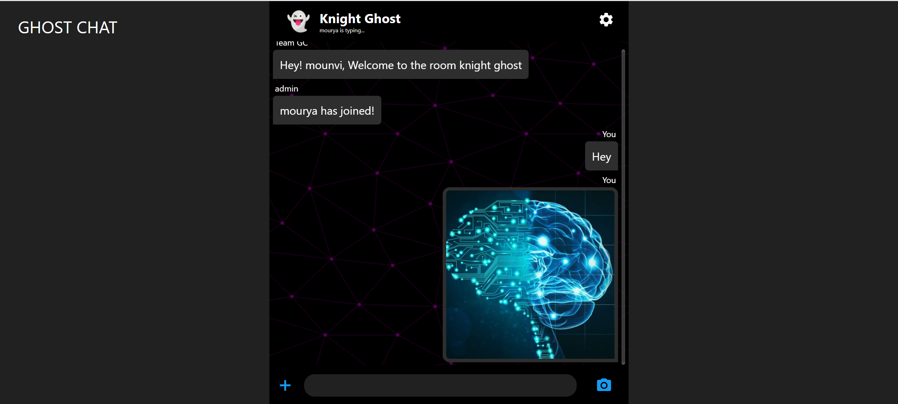

# 👻 GHOST CHAT (Anonymous chatting app)
## 🌟 Features:-
```
    Text Messaging
    Send Image files
    Capture images and share them
    Change the chat background
    View the list of online users
    Status of message "typing"
```
## 👩‍💻 Tech Stack:-
```
    ReactJS 
    NodeJS
    Socket.io
```
## 📷 Snapshot:-



## 🤔 How to run it locally:- 
```
git clone https://github.com/mounvip1525/ghost-chat.git
cd server & npm i 
npm start 
Open a new terminal in the same folder
cd chat-app & npm i
npm start
```
<h2 align="center"><br><a href="https://ghost-chaat.netlify.app/">Try it now</a></h2>
